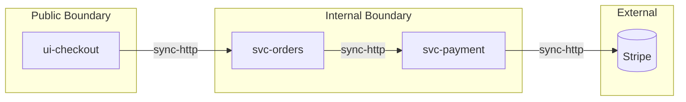

# System Graph Contract

> **Contract ID:** `system-graph-contract@1.0`
> **Producer:** `system-intelligence`
> **Consumers:** `risk-intelligence`, `test-strategy-intelligence`, `api-testing-intelligence`, `e2e-intelligence`, `regression-intelligence`

The system graph is the structural model of the feature: services, modules, integrations, data flows, boundaries. It is what every downstream system uses to know "where does this code live and what does it talk to."

---

## 1. Artifact Files

```
shared-artifacts/system-graphs/<feature>.json          ← canonical structured form
shared-artifacts/system-graphs/<feature>.md            ← narrative + tables
shared-artifacts/system-graphs/<feature>.diagram.mmd   ← Mermaid (flowchart LR)
shared-artifacts/dependency-maps/<feature>.json        ← dependency-only projection
```

---

## 2. Frontmatter

```yaml
---
contract: system-graph-contract@1.0
producer: system-intelligence
producer_run_id: <run-id>
feature: <feature-slug>
sources:
  - input/hld/...
  - input/lld/...
  - input/api-specs/...
generated_at: <ISO-8601>
checksum: sha256:<hex>
---
```

---

## 3. Schema (JSON)

```ts
type SystemGraph = {
  components: Component[]
  integrations: Integration[]
  data_flows: DataFlow[]
  boundaries: Boundary[]
  externals: External[]
}

type Component = {
  component_id: string                    // "svc-orders", "ui-checkout"
  name: string
  kind: "service" | "module" | "ui" | "worker" | "library" | "data-store" | "queue" | "cache"
  language?: string
  owner_team?: string
  responsibility: string
  exposes:
    apis?: string[]                       // operationIds
    events?: string[]                     // event names
    ui_routes?: string[]
  consumes:
    apis?: string[]
    events?: string[]
    data_stores?: string[]
  evidence: Evidence[]
}

type Integration = {
  integration_id: string                  // "int-orders-payment"
  from: string                            // component_id
  to: string                              // component_id or external_id
  kind: "sync-http" | "async-event" | "rpc" | "db-read" | "db-write" | "queue-publish" | "queue-consume"
  protocol?: string
  data_payload?: string                   // ref to schema
  sla?: { latency_ms?: number, error_budget_pct?: number }
  evidence: Evidence[]
}

type DataFlow = {
  flow_id: string                         // "df-order-creation"
  description: string
  steps: DataFlowStep[]
  evidence: Evidence[]
}

type DataFlowStep = {
  step_id: string
  from: string                            // component_id
  to: string
  payload: string
  transformation?: string
}

type Boundary = {
  boundary_id: string
  name: string                            // "Public API", "Internal Service Mesh"
  kind: "public" | "private" | "trusted" | "untrusted" | "tenant-scoped"
  contains: string[]                      // component_ids
  enforces: string[]                      // policy hints (auth, encryption, etc.)
}

type External = {
  external_id: string                     // "ext-stripe", "ext-sendgrid"
  name: string
  kind: "saas" | "third-party-api" | "marketplace" | "regulator" | "infra"
  contracts:
    inbound?: string[]                    // schemas we receive
    outbound?: string[]                   // schemas we send
  reliability?: string                    // "99.9% per Stripe SLA"
}
```

---

## 4. Hard Rules

1. Every Component MUST have ≥1 evidence entry.
2. Every Integration's `from` and `to` MUST resolve to declared Components or Externals.
3. Every DataFlow step MUST reference declared Components.
4. Every Boundary MUST contain ≥1 Component.
5. The graph MUST be connected: every Component reachable from at least one Boundary or External.
6. No orphaned Components (declared but with zero integrations and not in any boundary).

---

## 5. Mermaid Diagram

The `.diagram.mmd` file uses `flowchart LR` with subgraphs for boundaries:



The state-machine-mcp validates the diagram matches the JSON.

---

## 6. Dependency Map Projection

The `dependency-maps/<feature>.json` is a derived, lighter projection focused on dependencies:

```json
{
  "nodes": [...component_ids...],
  "edges": [
    { "from": "ui-checkout", "to": "svc-orders", "kind": "sync-http", "criticality": "high" }
  ]
}
```

`criticality` is computed from blast-radius analysis in risk-intelligence.

---

## 7. Cross-Artifact Use

| Consumer | What it uses |
|---|---|
| risk-intelligence | components + integrations to compute blast-radius |
| test-strategy-intelligence | boundaries to scope test coverage |
| api-testing-intelligence | externals + integrations to choose mock strategy |
| e2e-intelligence | UI + boundary topology to plan journeys |
| regression-intelligence | dependency-maps to compute change impact |

---

## 8. Validators

| Validator | Checks |
|---|---|
| `artifact-validator` | schema conformance |
| `consistency-validator` | references resolve, graph connected |
| `traceability-validator` | evidence on every Component / Integration |
| `completeness-validator` | non-empty graph, ≥1 boundary |

---

## 9. Versioning

- 1.0 — initial.
- 1.x — add fields (`metrics`, `health_endpoints`).
- 2.0 — restructure node/edge model.
