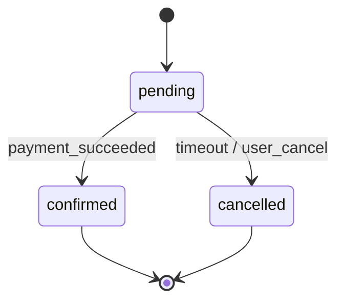

# state-machine-mcp

> **MCP server.** State machine extraction, validation, finalization, Mermaid rendering.

---

## Purpose

Both business-flow-intelligence and (potentially) system-intelligence work with state machines. The MCP centralizes integrity checks and Mermaid generation.

---

## Tools

| Tool | Args | Returns |
|---|---|---|
| `extract-states(corpus)` | `NormalizedCorpus` | `StatePreliminary[]` |
| `extract-transitions(corpus, states)` | `NormalizedCorpus, StatePreliminary[]` | `TransitionPreliminary[]` |
| `validate-and-finalize(preliminary)` | `StateMachinePreliminary` | `{ machine: StateMachine, issues: Issue[] }` |
| `check-integrity(machine)` | `StateMachine` | `{ ok: boolean, orphans: string[], issues: Issue[] }` |
| `render-mermaid(machine)` | `StateMachine` | `mermaid` (stateDiagram-v2 syntax) |
| `validate-twin(structured, mermaid)` | `{ structured: StateMachine, mermaid: string }` | `{ match: boolean, diff: Diff[] }` |

---

## Integrity rules

- ≥1 initial state declared
- ≥1 terminal (or explicit "no terminal" with reason)
- Every transition's `from`/`to` references a declared state
- No orphan states (every state reachable from initial)
- Every transition has non-empty `trigger`
- Every terminal state has zero outgoing transitions

Failures → returned in `issues[]` for the agent to address.

---

## Mermaid rendering

`validate-twin` ensures the rendered diagram matches the structured artifact (no drift).

---

## Used by

- agent: `state-transition-extractor`, `mermaid-generator`
- skill: `analysis-extraction`, `mermaid-pack`
- consumer: e2e-intelligence (state-anchored journey assertions)
