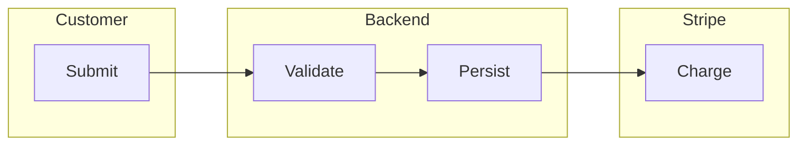
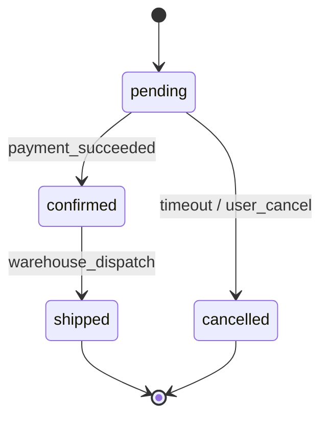

# Mermaid Visual Standards (System Rule)

> Domain rule. Defines the visual style for business-flow Mermaid diagrams.

---

## 1. Init Block (always at the top of `business-flow-mermaid.md`)

```mermaid
%%{init: {
  'theme': 'base',
  'themeVariables': {
    'fontFamily': 'system-ui, -apple-system, Segoe UI, Roboto, sans-serif',
    'primaryColor': '#0d6efd',
    'primaryTextColor': '#000',
    'primaryBorderColor': '#0a58ca',
    'lineColor': '#212529'
  }
}}%%
```

---

## 2. Node Classes

```mermaid
classDef startEnd fill:#0f5132,stroke:#0f5132,color:#fff
classDef process fill:#cfe2ff,stroke:#0d6efd,color:#000
classDef decision fill:#fff3cd,stroke:#ffc107,color:#000
classDef exception fill:#f8d7da,stroke:#dc3545,color:#000
classDef external fill:#e2e3e5,stroke:#6c757d,color:#000
classDef note    fill:#d1e7dd,stroke:#198754,color:#000
classDef async   fill:#d8e9ff,stroke:#0a58ca,color:#000,stroke-dasharray: 4 4
```

| Class | Use for |
|---|---|
| `startEnd` | Entry / exit / terminal nodes |
| `process` | Standard action steps |
| `decision` | Branches / conditions |
| `exception` | Error / failure paths |
| `external` | Third-party services |
| `note` | Annotations / observations |
| `async` | Background / queued / event-driven |

---

## 3. Link Styles

| Kind | Syntax |
|---|---|
| Sync action | `A --> B` |
| Conditional | `A -->|"cond=true"| B` |
| Async / event | `A -.->|"event"| B` (dashed) |
| Failure | `A -->|"error"| ERR:::exception` |

---

## 4. Swimlane Pattern (LR + subgraphs)



Subgraphs MUST match Section 4 actors exactly.

---

## 5. State Diagram Pattern (stateDiagram-v2)



Every state in the diagram MUST exist in `state-machine.json`. Every transition MUST have a trigger label.

---

## 6. Semantic Icon Tokens

Tokens of form `domain.object.state` validated against `assets/icon-manifest.json`. Add icons via Mermaid `:::` syntax with FontAwesome library or built-in shapes.

Example:
```
A[<i class='fa fa-cart'></i> Cart]:::process
```

When the icon manifest lacks an entry, the diagram renders without the icon (no failure) but the rule-analysis-mcp emits a finding.

---

## 7. Constraints

| Constraint | Rule |
|---|---|
| Max nodes per diagram | 60 |
| Max edges per diagram | 100 |
| Max actor subgraphs in swimlane | 8 (split if more) |
| Edge labels | ≤ 30 chars (multi-line allowed via `<br/>`) |
| Node labels | ≤ 40 chars (multi-line allowed) |

---

## 8. Validation

- Every diagram MUST compile (`mmdc --validate`).
- Every node MUST be referenced in the structured artifact (state machine state, flow row id, etc.).
- Every transition label MUST appear as a trigger in `state-machine.json`.
- Init block MUST be present.
- No emoji in node labels (use semantic icon tokens instead).

---

## 9. Why this discipline

Mermaid output that "looks right" but doesn't compile, or has nodes that don't appear in the analysis, is a regression. The visual standards make diagrams reproducible and verifiable, not decorative.
