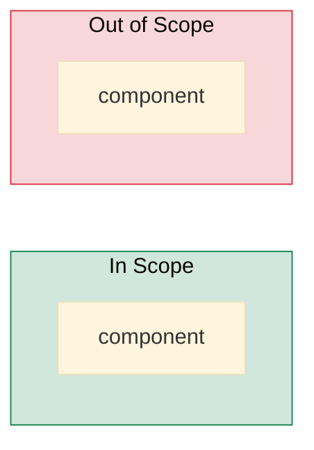

# [<Feature>] System-Level Test Strategy

---

## 1. General Purpose

> What system / module / feature is being tested. Acceptance goal.

<auto-populated from BF §3 + §1>

---

## 2. System Overview Diagram

---

## 3. Scope & Objective

| Scope ID | Feature | Test Objective | In Scope | Out of Scope | Priority | QC Owner | Linked Risks |
|---|---|---|---|---|---|---|---|
| SC01 | <feature> | <objective> | <list> | <list> | p0 | qa-team | R01, R03 |

---

## 4. Testing Approach

| Approach ID | Scope | Test Levels | Test Types | Manual % | Auto % | AI % | Tool / Framework | Strategy Notes |
|---|---|---|---|---|---|---|---|---|
| AP01 | SC01 | system, e2e | functional, abuse-failure | 20 | 50 | 30 | Playwright + Newman | Per-status coverage; abuse-failure for R01 |

---

## 5. Risk & Mitigation

| Risk ID | Description | Impact | Likelihood | Test Mitigation | Test Artifacts | Owner |
|---|---|---|---|---|---|---|
| R01 | Double-charge on payment retry | major | possible | Verify idempotency key honored across retries | api: SS03; e2e: journey-payment-retry | engineering |

---

## 6. Dependencies

| Dependency ID | Name | Category | Owner | Status | Impact if Delayed | Deadline |
|---|---|---|---|---|---|---|
| DP01 | Stripe sandbox keys | third-party | platform | ready | – | – |

---

## 7. Definition of Done

| DoD ID | Criterion | Metric | Threshold | Measurement Plan | Source Artifact |
|---|---|---|---|---|---|
| DOD01 | All p0 endpoints have per-status coverage | per-status coverage % across p0 | ≥ 95% | Computed from coverage_matrix | api-analysis-contract |
| DOD02 | All p0 user journeys pass | journey pass rate (priority=p0) | 100% | Playwright dashboard | e2e-contract |
| DOD03 | Every high+critical risk has ≥1 abuse-failure scenario verified | risk-to-abuse-coverage | 100% | scenario-contract + verification report | risk-contract |
